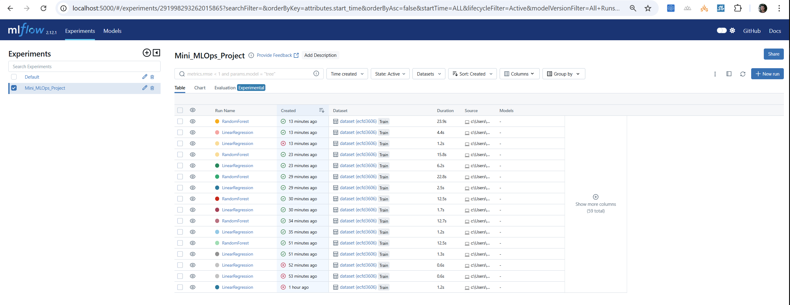

# MLOps Pipeline for California Housing Price Prediction

This project demonstrates a complete MLOps pipeline (assigment #2) using MLflow tracking and FastAPI deployment for predicting California housing prices. The pipeline includes data preprocessing, model training with multiple algorithms, experiment tracking, and a mock deployment service.

## Quick Start

### Prerequisites
- Python 3.11
- uv (Python package manager)
- Docker and Docker Compose

### Environment Setup

1. **Create a virtual environment with Python 3.11:**
```bash
uv venv -p 3.11
```

2. **Activate the virtual environment:**

On Windows (PowerShell):
```powershell
.\.venv\Scripts\Activate.ps1
```

On Linux:
```bash
source .venv/bin/activate
```

3. **Install prerequisites:**
```bash
uv pip install -r requirements.txt
```

### Start MLflow Tracking Server

Start the MLflow tracking server using Docker Compose:
```bash
docker-compose up -d
```

The MLflow UI will be available at: http://localhost:5000

## Training Pipeline

### Dataset
The pipeline uses the **California Housing dataset** from scikit-learn, which contains:
- **20,640 samples** of California housing districts. NOTE: After having removed rows with missing values the number of samples was still 20640 samples.
- **8 features**: MedInc, HouseAge, AveRooms, AveBedrms, Population, AveOccup, Latitude, Longitude
- **Target**: Median house value in hundreds of thousands of dollars

### Data Cleansing
- **Missing Values**: Removes any rows containing missing values using `df.dropna()`

### Feature Engineering
- **Standardization**: All numerical features are standardized using `StandardScaler`
- **No additional feature creation** - uses original 8 features as-is
- **Preprocessing Pipeline**: Features are processed through a scikit-learn ColumnTransformer

### Training Set Generation
- **Train/Test Split**: 80% training, 20% testing
- **Random State**: Fixed at 42 for reproducibility
- **Stratification**: None applied (regression problem)

### Model Training
The pipeline trains and compares two models:

1. **Linear Regression**
   - Simple baseline model
   - No hyperparameters tuned

2. **Random Forest Regressor**
   - 100 estimators
   - Random state fixed at 42
   - Default hyperparameters

### Experiment Tracking
- **MLflow Integration**: All experiments tracked automatically
- **Metrics Logged**: RMSE (Root Mean Square Error)
- **Artifacts Saved**: 
  - Model pipelines (.pkl files)
  - Prediction vs Actual plots
  - Deployment notes
  - Feature visualization plots

Screenshot of some experiment runs in MLFlow




### Run the Training Pipeline
Execute the Jupyter notebook:
```bash
jupyter notebook mlops_pipeline.ipynb
```

Or convert and run as a Python script:
```bash
jupyter nbconvert --to script mlops_pipeline.ipynb
python mlops_pipeline.py
```

## 🚀 Mock Deployment

### How It Works
The mock deployment uses **FastAPI** to serve the trained model:

- **Model Loading**: Loads the trained Random Forest pipeline from `model/RandomForest_pipeline.pkl`
- **Input Validation**: Uses Pydantic models to validate incoming requests
- **Preprocessing**: Automatically applies the same preprocessing used during training
- **Prediction**: Returns median house value predictions

### Start the Deployment Service
```bash
python serve_model.py
```

The API will be available at: http://localhost:8082

### API Endpoints

#### Health Check
```bash
GET http://localhost:8082/
```

#### Make Predictions
```bash
POST http://localhost:8082/predict
```

### Testing with Swagger UI

1. **Access Swagger UI**: Navigate to http://localhost:8082/docs
2. **Click on POST /predict** endpoint
3. **Click "Try it out"**
4. **Use the following test input values:**

```json
{
  "MedInc": 8.3252,
  "HouseAge": 41.0,
  "AveRooms": 6.9841,
  "AveBedrms": 1.0238,
  "Population": 322.0,
  "AveOccup": 2.5556,
  "Latitude": 37.88,
  "Longitude": -122.23
}
```

5. **Click "Execute"** to get the prediction

### Testing with curl
```bash
curl -X POST "http://localhost:8082/predict" \
  -H "Content-Type: application/json" \
  -d '{
    "MedInc": 8.3252,
    "HouseAge": 41.0,
    "AveRooms": 6.9841,
    "AveBedrms": 1.0238,
    "Population": 322.0,
    "AveOccup": 2.5556,
    "Latitude": 37.88,
    "Longitude": -122.23
  }'
```

Expected response:
```json
{
  "predicted_median_house_value": 4.526
}
```

## 📁 Project Structure

```
assignment2/
├── README.md                    # This file
├── requirements.txt             # Python dependencies
├── docker-compose.yml          # MLflow server configuration
├── mlops_pipeline.ipynb         # Training pipeline notebook
├── serve_model.py              # FastAPI deployment service
├── model/                      # Model artifacts and visualizations
│   ├── *_pipeline.pkl          # Trained model pipelines
│   ├── *_pred_vs_actual.png    # Model performance plots
│   ├── *_vs_target.png         # Feature visualization plots
│   └── *_deployment_notes.txt  # Deployment documentation
└── mlflow/                     # MLflow tracking data
    └── mlruns/                 # Experiment runs and artifacts
```

## 🔧 Configuration

### Model Selection
To switch between models, edit line 12 in `serve_model.py`:
```python
# Use Random Forest (default)
model = joblib.load("model/RandomForest_pipeline.pkl")

# Or use Linear Regression
model = joblib.load("model/LinearRegression_pipeline.pkl")
```

### Port Configuration
- **MLflow UI**: Port 5000 (configurable in docker-compose.yml)
- **FastAPI Service**: Port 8082 (configurable in serve_model.py)

## 📊 Model Performance

Based on the training results:
- **Linear Regression RMSE**: ~0.5559
- **Random Forest RMSE**: ~0.2552

The Random Forest model performs significantly better and is used by default in the deployment.
