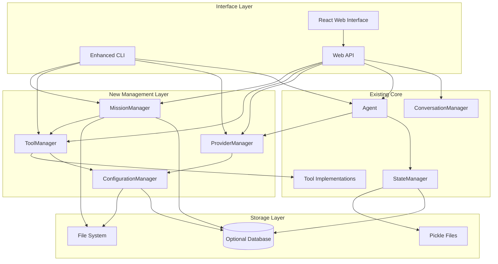

# Agent_v2 Brownfield Enhancement Architecture

## Introduction

This document outlines the architectural approach for enhancing the existing agent_v2 project with general-purpose agent capabilities, extensible tool ecosystem, multi-provider LLM support, sophisticated CLI tooling, predefined missions, and web interface capabilities. Its primary goal is to serve as the guiding architectural blueprint for AI-driven development of new features while ensuring seamless integration with the existing system.

**Relationship to Existing Architecture:**
This document supplements existing project architecture by defining how new components will integrate with current systems. Where conflicts arise between new and existing patterns, this document provides guidance on maintaining consistency while implementing enhancements.

### Existing Project Analysis

**Current Project State:**
- **Primary Purpose:** ReAct-style AI execution agent with planning, tool integration, and conversation management
- **Current Tech Stack:** Python 3.11+, FastAPI, OpenAI/LiteLLM, aiofiles, structlog, AsyncIO architecture
- **Architecture Style:** Modular component-based with Agent-Tool-StateManager pattern
- **Deployment Method:** Direct Python execution with CLI interface

**Available Documentation:**
- Basic README.md (minimal)
- Inline code documentation in agent.py (comprehensive system prompt and workflow)
- Tool implementations with clear abstractions

**Identified Constraints:**
- Current tight coupling to OpenAI models via litellm
- CLI-only interface limits broader adoption
- Tool discovery and registration is manual
- No mission templating or reusability system
- State management is file-based pickle (not scalable for microservices)

## Enhancement Scope and Integration Strategy

**Enhancement Overview:**
- **Enhancement Type:** Platform transformation - from single-purpose agent to general-purpose agent platform
- **Scope:** Major architectural expansion with backward compatibility
- **Integration Impact:** High - significant new components while preserving existing core functionality

**Integration Approach:**
- **Code Integration Strategy:** Extend existing Agent-Tool-StateManager pattern with plugin architecture, provider abstraction layer, and mission templating system
- **Database Integration:** Introduce optional database persistence alongside existing pickle-based state management for scalability
- **API Integration:** Add REST API layer above existing agent execution while preserving existing CLI interface
- **UI Integration:** Add React web interface consuming REST API, maintain existing CLI as primary development interface

**Compatibility Requirements:**
- **Existing API Compatibility:** Maintain current Agent.execute() method signature, preserve all existing AgentEvent types
- **Database Schema Compatibility:** Extend state dictionary structure, maintain backward compatibility with pickle-based state loading
- **UI/UX Consistency:** Preserve existing CLI workflows, add web interface as complementary channel
- **Performance Impact:** Maintain async execution patterns, ensure new components are optional and don't impact existing performance

## Tech Stack Alignment

### Existing Technology Stack

| Category | Current Technology | Version | Usage in Enhancement | Notes |
|----------|-------------------|---------|---------------------|-------|
| Runtime | Python | 3.11+ | Core platform | Maintain as primary runtime |
| Web Framework | FastAPI | 0.116.1+ | Expand for REST API | Extend existing minimal usage |
| HTTP Client | aiohttp | 3.9+ | Tool implementations | Continue for tool HTTP operations |
| LLM Integration | litellm | 1.7.7.0 | Abstract to provider layer | Wrap in provider abstraction |
| State Management | pickle + aiofiles | Built-in + 23.2.1 | Extend with database option | Maintain for backward compatibility |
| Logging | structlog | 24.2.0 | Expand for platform logging | Enhance existing usage |
| Process Management | uvicorn | 0.35.0+ | Web server for API/UI | Expand existing minimal usage |

### New Technology Additions

| Technology | Version | Purpose | Rationale | Integration Method |
|------------|---------|---------|-----------|-------------------|
| SQLAlchemy | 2.0+ | Optional database persistence | Scalable state management for microservice deployment | Optional dependency, fallback to pickle |
| Typer | 0.9+ | Enhanced CLI framework | Rich CLI experience with commands, help, validation | Replace argparse in taskforce_cli.py |
| Pydantic | 2.0+ | Mission/Tool schema validation | Type safety and validation for extensible system | Define mission templates and tool schemas |
| React | 18+ | Web interface | Modern web UI for broader accessibility | Separate frontend consuming REST API |
| Node.js | 18+ | Frontend build system | React development and build pipeline | Development dependency only |
| Redis | 7+ | Optional session storage | Scalable session management for web interface | Optional deployment dependency |

## Data Models and Schema Changes

### New Data Models

#### MissionTemplate
**Purpose:** Define reusable mission patterns with parameterization
**Integration:** Extends existing mission string concept with structured templates

**Key Attributes:**
- template_id: str - Unique identifier for the mission template
- name: str - Human-readable template name
- description: str - Template purpose and usage
- parameters: Dict[str, ParameterSpec] - Required and optional parameters
- mission_template: str - Template string with parameter placeholders
- tools_required: List[str] - Tools that must be available for this mission
- validation_rules: List[ValidationRule] - Parameter validation specifications

**Relationships:**
- **With Existing:** Generates mission strings compatible with current Agent.execute()
- **With New:** References ToolRegistry for validation, used by CLI and web interface

#### ToolRegistry
**Purpose:** Dynamic tool discovery and registration system
**Integration:** Extends existing manual tool registration in Agent.create_agent()

**Key Attributes:**
- tool_id: str - Unique tool identifier
- tool_class: Type[Tool] - Tool implementation class
- category: str - Tool categorization (file, web, git, etc.)
- dependencies: List[str] - Required system dependencies
- config_schema: Dict[str, Any] - Tool-specific configuration schema
- enabled: bool - Whether tool is available in current environment

**Relationships:**
- **With Existing:** Provides Tools for existing Agent initialization
- **With New:** Used by MissionTemplate validation, CLI tool listing

#### ProviderConfig
**Purpose:** LLM provider abstraction and configuration
**Integration:** Replaces direct litellm usage with configurable provider system

**Key Attributes:**
- provider_id: str - Provider identifier (openai, anthropic, local, etc.)
- model_name: str - Specific model within provider
- api_key: Optional[str] - Authentication credential
- base_url: Optional[str] - Custom endpoint URL
- parameters: Dict[str, Any] - Provider-specific parameters (temperature, etc.)
- rate_limits: RateLimitConfig - Rate limiting configuration

**Relationships:**
- **With Existing:** Provides models for existing Agent LLM calls
- **With New:** Configured through CLI and web interface

### Schema Integration Strategy

**Database Changes Required:**
- **New Tables:** mission_templates, tool_registry, provider_configs, agent_sessions (if database persistence enabled)
- **Modified Tables:** None - existing pickle state format remains unchanged
- **New Indexes:** template_id, tool_category, provider_id, session_id indexes for performance
- **Migration Strategy:** Dual persistence - maintain pickle compatibility, add database as optional enhancement

**Backward Compatibility:**
- All existing state files continue to work without modification
- Database persistence is opt-in through configuration
- Existing Agent.create_agent() method continues to work with manual tool specification

## Component Architecture

### New Components

#### MissionManager
**Responsibility:** Mission template management, parameter validation, and mission generation
**Integration Points:** CLI command system, web interface API, Agent execution pipeline

**Key Interfaces:**
- list_templates() → List[MissionTemplate]
- validate_parameters(template_id, params) → ValidationResult
- generate_mission(template_id, params) → str
- register_template(template) → bool

**Dependencies:**
- **Existing Components:** Agent (for mission execution)
- **New Components:** ToolRegistry (for tool validation)

**Technology Stack:** Python core with Pydantic validation, file-based or database storage

#### ProviderManager
**Responsibility:** LLM provider abstraction, configuration management, and request routing
**Integration Points:** Agent LLM calls, configuration system, monitoring/logging

**Key Interfaces:**
- get_provider(provider_id) → Provider
- list_available_models() → List[ModelInfo]
- create_completion(provider_id, messages, **kwargs) → LLMResponse
- validate_provider_config(config) → ValidationResult

**Dependencies:**
- **Existing Components:** Agent (replaces direct litellm calls)
- **New Components:** ConfigurationManager

**Technology Stack:** litellm as backend with provider abstraction layer

#### ToolManager
**Responsibility:** Dynamic tool discovery, registration, and lifecycle management
**Integration Points:** Agent tool initialization, CLI tool commands, web interface tool listing

**Key Interfaces:**
- discover_tools() → List[ToolInfo]
- register_tool(tool_class) → bool
- get_available_tools() → List[Tool]
- validate_tool_dependencies(tool_id) → ValidationResult

**Dependencies:**
- **Existing Components:** Tool base class and implementations
- **New Components:** ConfigurationManager (for tool configuration)

**Technology Stack:** Python importlib for dynamic discovery, dependency validation

#### WebAPI
**Responsibility:** REST API layer for web interface and external integrations
**Integration Points:** Agent execution, session management, mission management

**Key Interfaces:**
- POST /api/sessions → SessionInfo
- POST /api/sessions/{id}/execute → ExecutionResult
- GET /api/missions/templates → List[MissionTemplate]
- GET /api/tools → List[ToolInfo]

**Dependencies:**
- **Existing Components:** Agent, ConversationManager, StateManager
- **New Components:** MissionManager, ToolManager, ProviderManager

**Technology Stack:** FastAPI with async handlers, WebSocket for real-time updates

#### EnhancedCLI
**Responsibility:** Rich CLI experience with commands, help, validation, and configuration
**Integration Points:** All system components for command execution

**Key Interfaces:**
- agent run <mission-template> → Interactive execution
- agent tools list/install/configure → Tool management
- agent missions list/create/edit → Mission template management
- agent providers list/configure → Provider management

**Dependencies:**
- **Existing Components:** Agent, existing CLI functionality
- **New Components:** All new managers for extended functionality

**Technology Stack:** Typer for CLI framework, Rich for enhanced output formatting

#### ReactWebInterface
**Responsibility:** Modern web interface for agent interaction and system management
**Integration Points:** WebAPI for all backend communication

**Key Interfaces:**
- Mission template selection and parameter input
- Real-time agent execution monitoring
- Tool management and configuration
- Provider configuration and testing

**Dependencies:**
- **Existing Components:** None direct (via API)
- **New Components:** WebAPI for all functionality

**Technology Stack:** React 18, TypeScript, WebSocket for real-time updates

### Component Interaction Diagram



## API Design and Integration

### API Integration Strategy
**API Integration Strategy:** REST API with WebSocket for real-time updates, maintaining existing internal interfaces
**Authentication:** JWT-based authentication for web interface, API key support for external integrations
**Versioning:** URL-based versioning (/api/v1/) with backward compatibility guarantees

### New API Endpoints

#### Session Management
- **Method:** POST
- **Endpoint:** /api/v1/sessions
- **Purpose:** Create new agent session with optional configuration
- **Integration:** Creates new session using existing ConversationManager

**Request:**
```json
{
  "mission_template_id": "microservice-setup",
  "parameters": {
    "service_name": "user-service",
    "language": "python"
  },
  "provider_config": {
    "provider_id": "openai",
    "model": "gpt-4"
  }
}
```

**Response:**
```json
{
  "session_id": "uuid",
  "status": "created",
  "mission": "Set up a new Python microservice named user-service...",
  "estimated_steps": 8
}
```

#### Mission Templates
- **Method:** GET
- **Endpoint:** /api/v1/missions/templates
- **Purpose:** List available mission templates with parameters
- **Integration:** Uses MissionManager to retrieve templates

**Request:**
```json
{
  "category": "development",
  "tools_available": ["git", "file", "shell"]
}
```

**Response:**
```json
{
  "templates": [
    {
      "template_id": "microservice-setup",
      "name": "Microservice Setup",
      "description": "Set up new microservice following company guidelines",
      "parameters": [
        {
          "name": "service_name",
          "type": "string",
          "required": true,
          "description": "Name of the microservice"
        }
      ],
      "tools_required": ["git", "file", "shell"]
    }
  ]
}
```

#### Tool Management
- **Method:** GET
- **Endpoint:** /api/v1/tools
- **Purpose:** List available tools with status and configuration
- **Integration:** Uses ToolManager for tool discovery and status

**Request:**
```json
{
  "category": "file",
  "include_disabled": false
}
```

**Response:**
```json
{
  "tools": [
    {
      "tool_id": "file_reader",
      "name": "File Reader",
      "category": "file",
      "enabled": true,
      "description": "Read file contents",
      "configuration_required": false
    }
  ]
}
```

## Source Tree Integration

### Existing Project Structure
```plaintext
capstone/agent_v2/
├── agent.py                    # Core Agent class (755 lines)
├── conversation_manager.py     # Conversation management (33 lines)
├── statemanager.py            # State persistence (70 lines)
├── taskforce_cli.py           # Basic CLI interface (53 lines)
├── tool.py                    # Tool base class (96 lines)
├── planning/
│   ├── planner.py             # Planning logic (573 lines)
│   └── todolist.py            # TodoList management (576 lines)
└── tools/
    ├── ask_user_tool.py       # User interaction tool (31 lines)
    ├── code_tool.py           # Python execution tool (113 lines)
    ├── file_tool.py           # File operations tool (105 lines)
    ├── git_tool.py            # Git operations tool (265 lines)
    ├── shell_tool.py          # Shell execution tool (203 lines)
    └── web_tool.py            # Web operations tool (119 lines)
```

### New File Organization
```plaintext
capstone/agent_v2/
├── agent.py                           # Existing core agent
├── conversation_manager.py            # Existing conversation management
├── statemanager.py                    # Existing state management
├── tool.py                           # Existing tool base class
├── managers/                         # New management layer
│   ├── __init__.py
│   ├── mission_manager.py            # Mission template management
│   ├── provider_manager.py           # LLM provider abstraction
│   ├── tool_manager.py               # Dynamic tool discovery
│   └── config_manager.py             # Configuration management
├── cli/                              # Enhanced CLI system
│   ├── __init__.py
│   ├── main.py                       # Enhanced CLI entry point
│   ├── commands/
│   │   ├── __init__.py
│   │   ├── agent_commands.py         # Agent execution commands
│   │   ├── mission_commands.py       # Mission management commands
│   │   ├── tool_commands.py          # Tool management commands
│   │   └── provider_commands.py      # Provider configuration commands
│   └── utils/
│       ├── __init__.py
│       ├── formatting.py             # Rich output formatting
│       └── validation.py             # Input validation helpers
├── api/                              # Web API layer
│   ├── __init__.py
│   ├── main.py                       # FastAPI application
│   ├── routes/
│   │   ├── __init__.py
│   │   ├── sessions.py               # Session management endpoints
│   │   ├── missions.py               # Mission template endpoints
│   │   ├── tools.py                  # Tool management endpoints
│   │   └── providers.py              # Provider configuration endpoints
│   ├── models/
│   │   ├── __init__.py
│   │   ├── requests.py               # API request models
│   │   ├── responses.py              # API response models
│   │   └── schemas.py                # Shared schema definitions
│   └── middleware/
│       ├── __init__.py
│       ├── auth.py                   # Authentication middleware
│       └── cors.py                   # CORS configuration
├── web/                              # React web interface
│   ├── package.json                  # Node.js dependencies
│   ├── src/
│   │   ├── components/
│   │   │   ├── AgentExecution.tsx    # Real-time execution view
│   │   │   ├── MissionBuilder.tsx    # Mission template selection
│   │   │   └── ToolManager.tsx       # Tool configuration
│   │   ├── services/
│   │   │   └── api.ts                # API client
│   │   └── App.tsx                   # Main application component
│   └── build/                        # Built static files
├── missions/                         # Mission templates
│   ├── __init__.py
│   ├── templates/
│   │   ├── microservice_setup.yaml   # Microservice creation template
│   │   ├── document_extraction.yaml  # Document processing template
│   │   └── general_development.yaml  # General development template
│   └── registry.py                   # Template registration
├── providers/                        # LLM provider implementations
│   ├── __init__.py
│   ├── base.py                       # Provider base class
│   ├── openai_provider.py            # OpenAI provider implementation
│   ├── anthropic_provider.py         # Anthropic provider implementation
│   └── local_provider.py             # Local model provider
├── planning/                         # Existing planning system
│   ├── planner.py                    # Existing planner
│   └── todolist.py                   # Existing todolist
├── tools/                            # Existing and new tools
│   ├── [existing tools]              # All existing tool files
│   └── registry.py                   # Tool auto-discovery system
├── docs/                             # Documentation
│   ├── architecture.md               # This document
│   ├── api.md                        # API documentation
│   └── mission_templates.md          # Mission template guide
├── config/                           # Configuration management
│   ├── __init__.py
│   ├── settings.py                   # Application settings
│   └── examples/
│       ├── development.yaml          # Development configuration
│       └── production.yaml           # Production configuration
└── tests/                            # Test suite expansion
    ├── unit/
    │   ├── test_managers.py          # Manager component tests
    │   └── test_api.py               # API endpoint tests
    └── integration/
        ├── test_mission_execution.py # End-to-end mission tests
        └── test_web_interface.py     # Web interface integration tests
```

### Integration Guidelines
- **File Naming:** Maintain existing snake_case convention, use descriptive names for new components
- **Folder Organization:** Group by functional area (managers, api, cli), maintain existing structure for core components
- **Import/Export Patterns:** Use relative imports within packages, absolute imports for cross-package dependencies, maintain existing import patterns

## Infrastructure and Deployment Integration

### Existing Infrastructure
**Current Deployment:** Direct Python script execution with virtual environment
**Infrastructure Tools:** Basic Python packaging (pyproject.toml), no containerization
**Environments:** Development only, no production deployment strategy

### Enhancement Deployment Strategy
**Deployment Approach:** Multi-mode deployment - maintain existing direct execution, add containerized microservice option
**Infrastructure Changes:** Add Docker support, optional database deployment, web server configuration
**Pipeline Integration:** Add build pipeline for React frontend, optional Docker image building

**Deployment Configurations:**
1. **Development Mode:** Existing direct execution with enhanced CLI
2. **Microservice Mode:** Containerized deployment with database persistence
3. **Hybrid Mode:** Enhanced CLI with optional web interface

### Rollback Strategy
**Rollback Method:** Configuration-based feature flags, backward-compatible changes only
**Risk Mitigation:** Gradual feature rollout, existing functionality preservation, comprehensive testing
**Monitoring:** Structured logging enhancement, optional metrics collection, error tracking

## Coding Standards and Conventions

### Existing Standards Compliance
**Code Style:** PEP 8 compliance, type hints throughout, comprehensive docstrings
**Linting Rules:** None currently enforced (recommend adding black, isort, mypy)
**Testing Patterns:** Limited testing (recommend pytest expansion)
**Documentation Style:** Inline comments and docstrings, minimal external documentation

### Enhancement-Specific Standards
- **Mission Templates:** YAML format with strict schema validation using Pydantic
- **API Design:** OpenAPI 3.0 specification compliance, consistent error response format
- **Web Interface:** TypeScript for type safety, React functional components with hooks
- **Configuration:** Environment variable configuration with fallback defaults
- **Provider Integration:** Consistent interface pattern following existing Tool abstraction

### Critical Integration Rules
- **Existing API Compatibility:** All existing Agent methods must maintain signature compatibility
- **Database Integration:** Database usage must be optional, pickle persistence must remain functional
- **Error Handling:** Integrate with existing structured logging, maintain existing error propagation patterns
- **Logging Consistency:** Extend existing structlog usage, maintain existing log levels and formatting

## Testing Strategy

### Integration with Existing Tests
**Existing Test Framework:** Minimal testing currently (pytest specified in dev dependencies)
**Test Organization:** Tests directory structure needs creation
**Coverage Requirements:** Target 80%+ coverage for new components, maintain existing functionality coverage

### New Testing Requirements

#### Unit Tests for New Components
- **Framework:** pytest with async support (pytest-asyncio)
- **Location:** tests/unit/ directory structure
- **Coverage Target:** 90% for new manager components, 80% for API endpoints
- **Integration with Existing:** Maintain existing agent functionality tests, extend with new component tests

#### Integration Tests
- **Scope:** End-to-end mission execution, API workflow testing, web interface integration
- **Existing System Verification:** Ensure all existing agent capabilities continue to function
- **New Feature Testing:** Mission template execution, provider switching, tool discovery

#### Regression Testing
- **Existing Feature Verification:** Automated test suite for all current agent capabilities
- **Automated Regression Suite:** CI/CD integration with pytest, coverage reporting
- **Manual Testing Requirements:** Web interface usability testing, CLI workflow validation

## Security Integration

### Existing Security Measures
**Authentication:** None currently (local execution only)
**Authorization:** File system permissions only
**Data Protection:** No encryption of state files
**Security Tools:** None currently implemented

### Enhancement Security Requirements
**New Security Measures:** JWT authentication for web interface, API key management for providers, input validation for all user inputs
**Integration Points:** Secure credential storage, rate limiting for API endpoints, CORS configuration for web interface
**Compliance Requirements:** OWASP guidelines for web application security, secure defaults for all configurations

### Security Testing
**Existing Security Tests:** None currently
**New Security Test Requirements:** Authentication bypass testing, input validation testing, API security scanning
**Penetration Testing:** Automated security scanning in CI/CD pipeline, manual security review for web interface

## Next Steps

### Story Manager Handoff
Create a story management approach for this brownfield enhancement implementation:

**Reference:** This brownfield enhancement architecture document defines the complete transformation roadmap
**Key Integration Requirements:** Maintain backward compatibility with existing Agent.execute() interface, preserve all current tool functionality, ensure optional deployment of new features
**Existing System Constraints:** Python 3.11+ requirement, asyncio architecture must be maintained, pickle-based state storage must remain functional alongside new database option
**First Story Implementation:** Begin with ProviderManager implementation to abstract LLM provider dependencies, followed by MissionManager for template system
**Integration Checkpoints:** After each major component, validate existing agent functionality remains intact, test new features with existing tool ecosystem

**Recommended Story Sequence:**
1. **Provider Abstraction:** Implement ProviderManager with OpenAI provider, maintain existing litellm calls
2. **Mission Template System:** Create MissionManager and basic template support
3. **Enhanced CLI:** Replace argparse with Typer, add mission and tool commands
4. **Tool Discovery:** Implement ToolManager for dynamic tool registration
5. **Web API:** Create FastAPI endpoints for core functionality
6. **React Interface:** Build web interface consuming API
7. **Advanced Features:** Add database persistence, monitoring, security features

### Developer Handoff
Development implementation guidance based on actual project analysis:

**Reference:** Use this architecture document and existing codebase patterns analyzed from capstone/agent_v2
**Integration Requirements:** Follow existing async/await patterns throughout, maintain Tool base class interface for all new tools, preserve Agent class constructor signature
**Key Technical Decisions:** Use composition over inheritance for new managers, maintain existing pickle state format alongside new database option, implement provider abstraction using strategy pattern similar to existing Tool pattern
**Existing System Compatibility:** All new components must be optional - system must function with only existing components enabled, new features activated through configuration flags
**Implementation Verification Steps:** Run existing taskforce_cli.py after each component addition, verify all current tools continue to work, test existing state file loading with StateManager

**Critical Development Principles:**
- Maintain existing asyncio execution patterns
- Preserve backward compatibility for all existing interfaces
- Use existing structured logging throughout new components
- Follow existing error handling and propagation patterns
- Implement new features as optional extensions, not replacements
