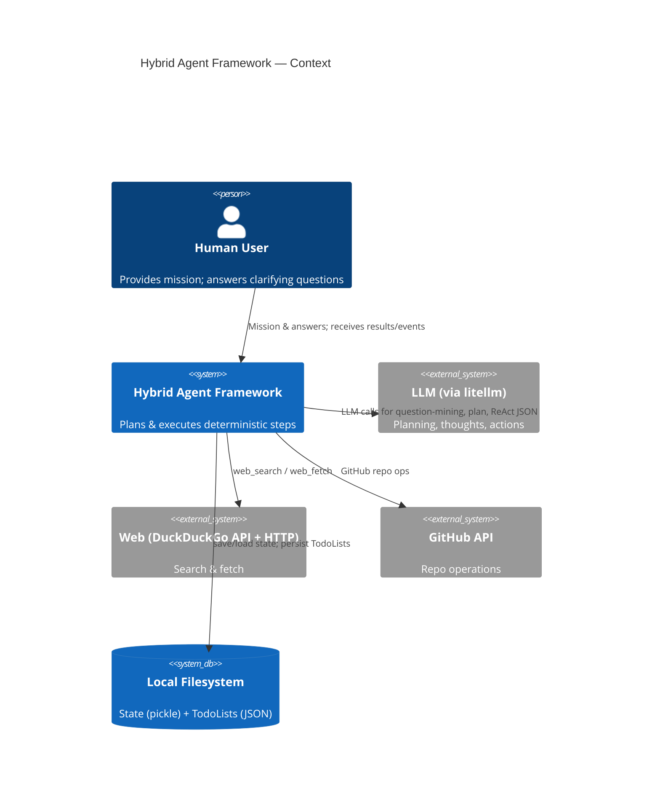
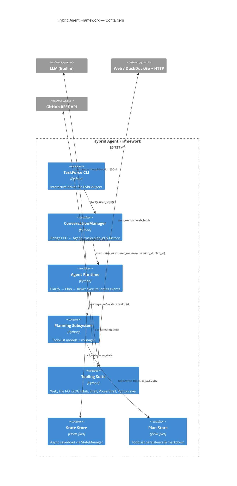
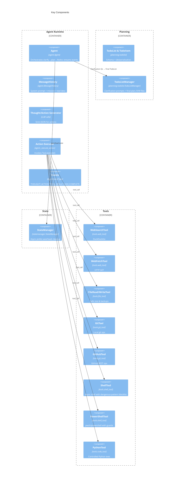
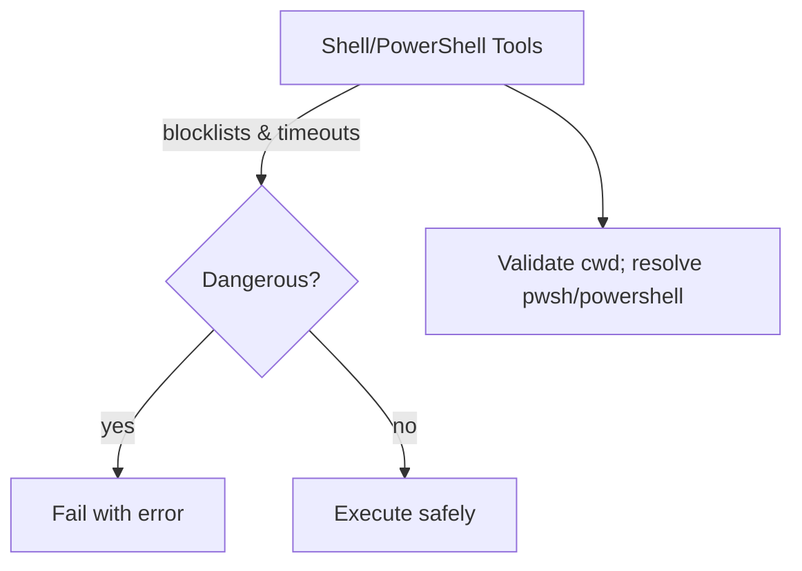
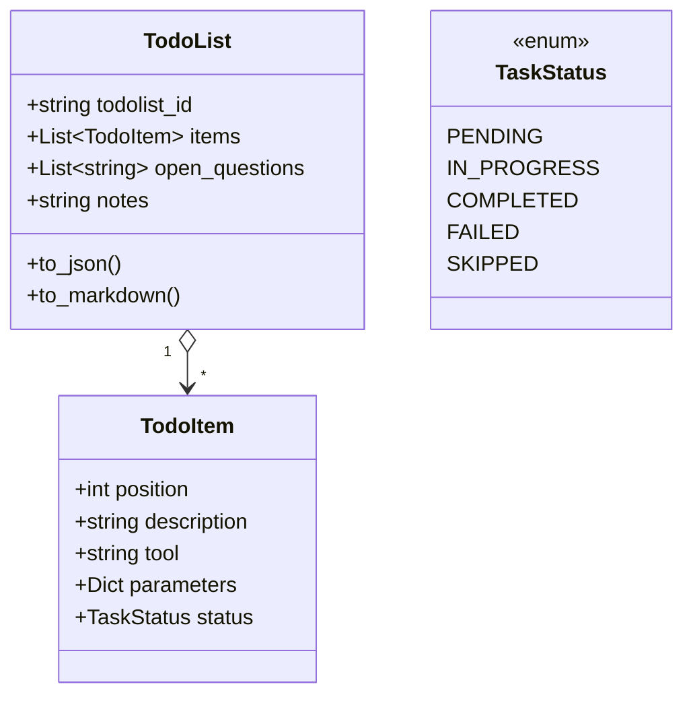
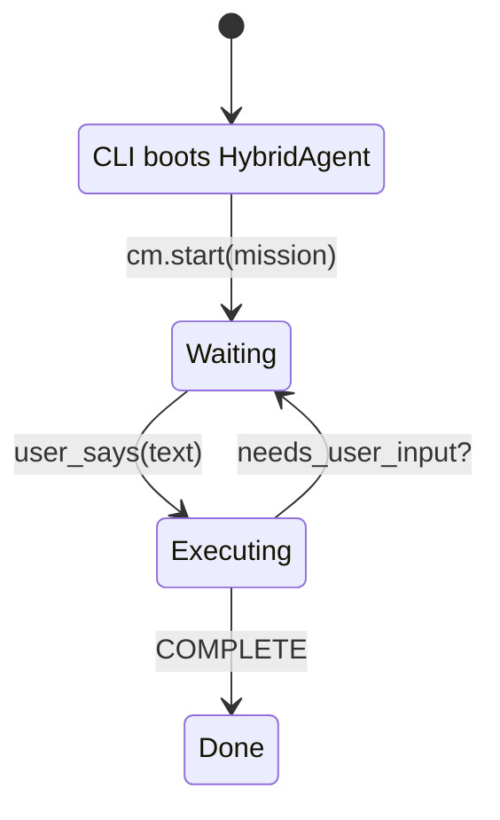

Awesome — here’s a **Mermaid-first** architecture doc of your current agent framework with C4 diagrams. I kept the prose light and placed everything important into diagrams. Citations point to the specific spots in your code.

# System Overview

A ReAct-style agent plans (clarifies first), then executes a strict TodoList using sandboxed tools; state and plans are persisted locally. &#x20;



**Why:** The agent streams events (THOUGHT/ACTION/TOOL\_RESULT/ASK/COMPLETE) and uses local files for state & plans. &#x20;

---

# Containers (C4 Level 2)



* **ConversationManager** keeps session/plan linkage.&#x20;
* **StateManager** persists per-session pickle asynchronously.&#x20;
* **TodoList** is the single source of truth (items/open\_questions/notes).&#x20;

---

# Components (C4 Level 3)



* **Models**: `TaskStatus`, `TodoItem`, `TodoList` with robust alias parsing & JSON/MD helpers. &#x20;
* **Tools** include safety checks (e.g., shell/pwsh pattern blocklists, timeouts). &#x20;
* **WebSearch** via DuckDuckGo’s API; tolerant to non-standard content-type. &#x20;

---

# Execution Flow (Mermaid Sequence)

```mermaid
sequenceDiagram
autonumber
participant U as User
participant A as Agent
participant SM as StateManager
participant TL as TodoListManager
participant L as LLM
participant T as Tools

U->>A: Mission / user_message
A->>SM: load_state(session_id)
SM-->>A: state (pending_question?, todolist_id?)
alt First run (no plan)
  A->>TL: extract_clarification_questions(mission, tools_desc)
  TL->>L: Clarification-Mining prompt (JSON array)
  L-->>TL: [{"key","question"},...]
  TL-->>A: unanswered?
  alt Any unanswered
    A-->>U: ASK_USER (single precise question)
    U->>A: answer
    A->>SM: save_state(pending_question cleared; answers)
  end
  A->>TL: create_todolist(No-ASK mode)
  TL->>L: Final plan prompt (strict JSON)
  L-->>TL: TodoList (no open_questions)
  TL-->>A: TodoList; persisted
else Resume with existing plan
  A->>TL: load_todolist_by_id(state.todolist_id)
end
loop For each TodoItem
  A->>L: generate Thought + Action (JSON)
  L-->>A: Thought/Action JSON
  A->>T: execute(action.tool, params)
  T-->>A: observation {success|error}
  A->>SM: save_state(last_observation, step status)
  A->>TL: update_todolist()
end
A-->>U: COMPLETE (TodoList markdown)
```

* Clarify → Final plan (no `ASK_USER` in plan), then ReAct over steps; each step sets status and persists. &#x20;
* Completion returns TodoList as Markdown.&#x20;

---

# Safety & Policies (at-a-glance)



* Shell dangerous pattern blocklists; timeout handling & process kill. &#x20;
* PowerShell validates cwd, resolves executable, same timeout/kill discipline. &#x20;

---

# Data Model Cheatsheet



Backed by robust (de)serialization and status normalization. &#x20;

---

# Operational Notes



* **TaskForce CLI** wires up `HybridAgent` and loops on user input. &#x20;
* **State** at `./agent_states/*.pkl` (async save/load + cleanup). &#x20;

---

If you want, I can export these Mermaid blocks into a single Markdown/PDF handout or split them into per-team variants (PM vs. Eng).
