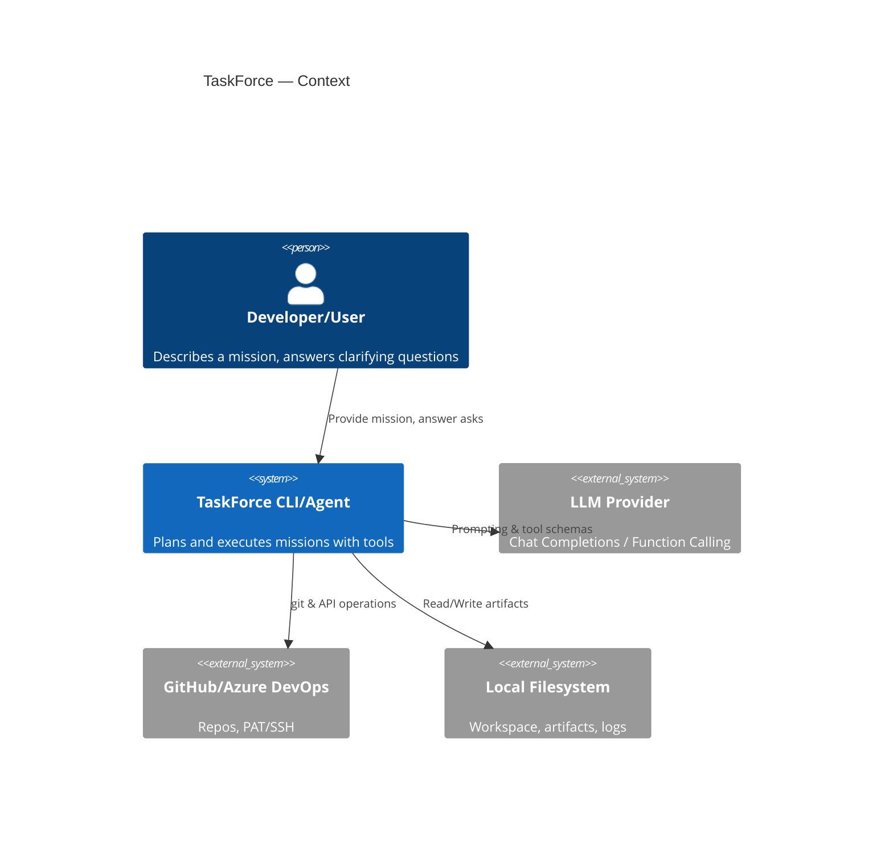
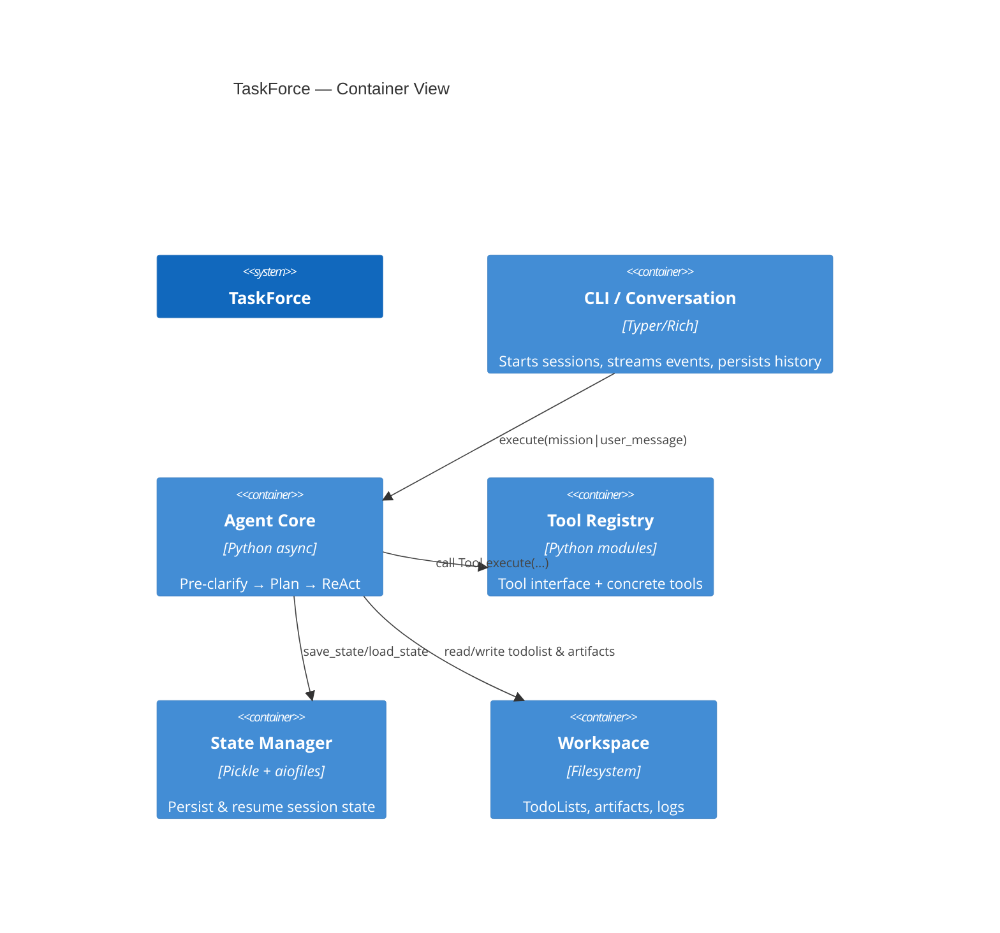
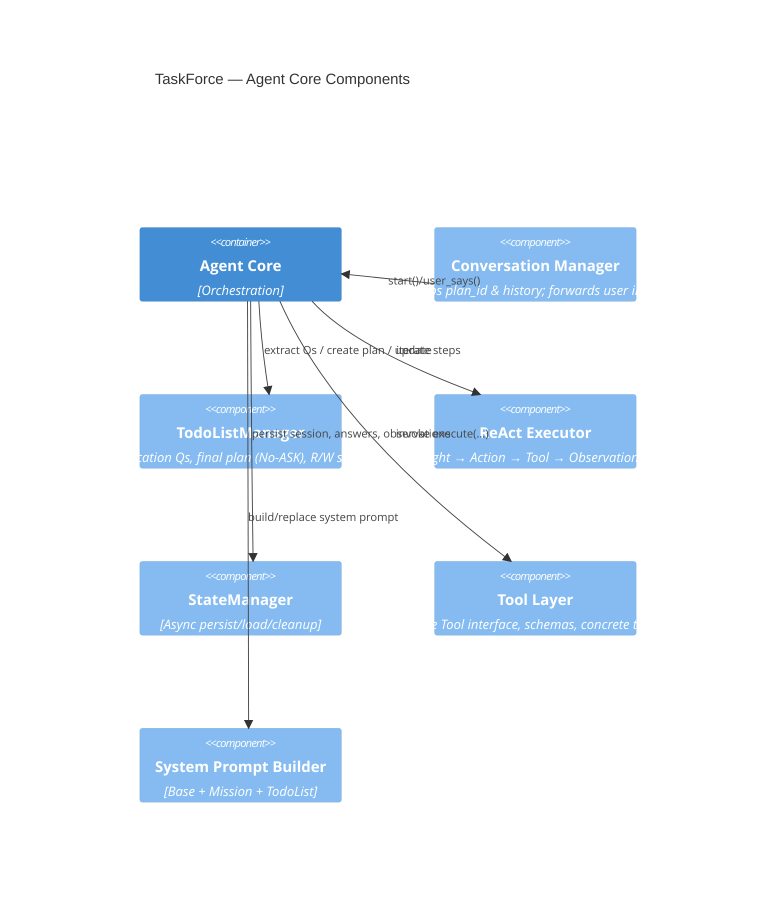

Here’s a **much more detailed technical report** on your **TaskForce Agent Framework**—with an expanded introduction, deep component breakdown (including `TodoListManager`), end-to-end execution flow (pre-clarification → planning → ReAct), and C4 Mermaid diagrams. I’ve grounded key details with short source citations to your uploaded code.

---

# Technical Report — TaskForce Agent Framework

## Introduction & Motivation

I built **TaskForce** to move beyond “agent as a black box” and truly understand how agents **plan**, **call tools**, and **consistently execute** real-world tasks. Building an agent that (a) extracts missing inputs up front, (b) creates a **deterministic plan**, and (c) **faithfully** carries out that plan with multiple tools turned out to be far tougher than expected—especially around **clarification timing**, **state management**, and **tool parameterization**. TaskForce is both a framework and a learning journey toward **transparent, modular, developer-friendly** AI agents.

---

## Executive Summary

**TaskForce** is a CLI-first, LLM-orchestrated agent that:

* Collects missing inputs with a **Pre-Clarification** pass.&#x20;
* Generates a **No-ASK** final plan (a strict Todo List) and hard-fails if any `ASK_USER` placeholders remain. &#x20;
* Executes the plan in a **ReAct** loop: for each step, generate a Thought → decide one Action → run a Tool → record Observation, possibly trigger `ask_user`.  &#x20;

---

# Architecture

## C4 — Context



## C4 — Container



## C4 — Component (Agent Core)



---

# Components in Depth

## Conversation Manager (CLI/UX Shell)

* Holds `session_id`, `plan_id`, and `history`. Delegates to `agent.execute(...)` for both starting a mission and processing subsequent user replies; updates stored history and plan id from the agent’s return. &#x20;
* The sample driver loop streams agent events (ASK\_USER, STATE\_UPDATED, COMPLETE) and lets the user answer questions interactively.&#x20;

## State Manager

* **Async** persistence (`aiofiles` + `pickle`) of session state: `answers`, `pending_question`, `todolist_id`, `last_observation`, etc. &#x20;
* Housekeeping: removal of old state files.&#x20;

## Tool Layer

* **Base interface** (`Tool`) with auto-generated **parameter schema** inferred from the tool’s `execute` signature—enables function-calling/tool-calling with correct JSON. &#x20;
* Concrete tools used by the agent include `PythonTool`, `FileReadTool`, `FileWriteTool`, `GitHubTool`, `GitTool`, `PowerShellTool`, `WebSearchTool`, `WebFetchTool`.&#x20;
* Example: `WebFetchTool` fetches URLs with timeout and lightweight HTML extraction; returns structured content. &#x20;
* `AskUserTool` is first-class to surface a **single, crisp** question to the user.&#x20;

## System Prompt & Policy

* A **generic system prompt** encodes core principles:

  * **Plan first**, **Clarify early** (use `ASK_USER` placeholders during planning), **Prefer tools**, **Update state** after each step.&#x20;
  * Decision policy: **tools > ask\_user > stop**; never assume implicit values.&#x20;
* The runtime system prompt is built from **Base + Mission + TodoList** sections and can be **replaced** once a plan is produced to provide the model with the current plan. &#x20;

## TodoListManager (Planning)

**Purpose.** Turn a mission + tools into a **strict, executable plan** (TodoList), with a two-phase strategy:

1. **Pre-Clarification (Ask-User phase).**

   * Extract missing inputs as a **JSON array** of closed, unambiguous questions keyed by stable identifiers (prefer `<tool>.<parameter>`). &#x20;
   * Deterministic prompting (`temperature=0`) to avoid drift; strict JSON parsing with robust error handling. &#x20;

2. **Final TodoList (No-ASK mode).**

   * Build a final plan with **no open questions** and **no `ASK_USER`** placeholders—enforced via **quality checks**. &#x20;
   * Writes/reads the TodoList JSON to disk; supports `get`, `update`, `delete`, and deterministic pathing.   &#x20;

**Plan as “Manus-style” TodoList.** Each item is **atomic**, single-responsibility, with `tool`, `parameters`, `depends_on`, and `status`. The manager also provides markdown rendering for visibility. &#x20;


Perfekt – ich ergänze deinen technischen Bericht um ein eigenes Kapitel **“Tools”**, das beschreibt, **wie Tools in TaskForce aufgerufen werden**, wie die Schnittstelle aussieht und wie die Einbettung in die ReAct-Loop funktioniert. Ich baue die Erklärung auf deinen Codefundamenten (`Tool`-Basisklasse, automatische Parameter-Schemata, Tool-Registry, ReAct-Executor) auf.

---

# Tools in TaskForce

## Design Principles

* **Uniform Interface**: Every tool inherits from a base `Tool` class with a common `execute(...)` signature.
* **Schema-Driven**: The framework auto-generates a JSON Schema for each tool’s parameters from its Python type hints. This enables LLMs to call tools through structured **function calling**.
* **First-Class Actions**: In the ReAct loop, `tool_call` is one of the limited allowed action types (`tool_call | ask_user | complete | update_todolist | error_recovery`).
* **Explicitness**: Tools never take implicit parameters. If an argument is missing, the agent must first ask the user (via `AskUserTool`) before calling.

---

## Tool Lifecycle in the Agent

### 1. Planning Phase

When the `TodoListManager` builds a plan, each step explicitly names:

* the **tool** to invoke,
* the **parameters** required,
* and the **expected outcome**.

If any parameters are unknown, the placeholder `ASK_USER` is inserted, and the plan cannot pass validation until all are resolved.

---

### 2. Decision (ReAct Thought/Action)

At runtime, the agent generates a **Thought** that selects one tool and prepares the **Action**:

```json
{
  "next_step_ref": 2,
  "rationale": "We need to fetch the URL content before processing",
  "action": {
    "type": "tool_call",
    "tool": "WebFetchTool",
    "input": { "url": "https://example.com" }
  },
  "expected_outcome": "HTML content of the page"
}
```

---

### 3. Execution

* The framework dispatches the call via the `Tool` interface:

  ```python
  result = await tool.execute(**parameters)
  ```
* Success/failure is wrapped into an **Observation** event, streamed back to the CLI:

  * `TOOL_STARTED`
  * `TOOL_RESULT {success, result, error}`

If execution fails, the agent may attempt **error\_recovery** (retry, adjust input, or ask the user).

---

### 4. Integration with State

* The **last observation** is persisted into the session state.
* If the tool indicated `requires_user = True`, the agent emits `ASK_USER` and stores `pending_question {answer_key, question}`.
* The next loop iteration hydrates TodoList parameters with the user’s answer.

---

## Example Tools

* **File Tools**:

  * `FileReadTool(path) → str`
  * `FileWriteTool(path, content)`
* **Code Execution**:

  * `PythonTool(code) → stdout/err`
* **System / DevOps**:

  * `GitTool` (clone, commit, push)
  * `PowerShellTool(command)`
* **Web**:

  * `WebSearchTool(query)`
  * `WebFetchTool(url, timeout)` with lightweight HTML parsing
* **Meta**:

  * `AskUserTool(question)` to pause execution and obtain required inputs

All follow the same **schema-based execution contract**, making them interchangeable building blocks in plans.

---

## Why This Matters

* **LLM Reliability**: By giving the model **strict tool schemas**, hallucinated or malformed calls are minimized.
* **Traceability**: Each tool call is logged as a separate event with parameters and results.
* **Extensibility**: New tools can be added by subclassing `Tool`; the schema is auto-extracted from type hints, so the agent knows immediately how to call them.


---

# End-to-End Flow

## 1) Pre-Clarification Pass (“Ask User” before planning)

* If there’s no existing plan, the agent first **extracts clarification questions**; if any are unanswered, it yields an **ASK\_USER** event and **pauses** execution. The question is stored with a **stable key** (`answer_key`) so the reply can be merged back into `answers`. &#x20;
* At the CLI, you print the question and collect user input (the driver loop shows this interaction).&#x20;

## 2) Final Plan Creation (No-ASK mode)

* After **all questions are answered**, the agent requests a **strict final TodoList** from `TodoListManager.create_todolist(...)` using those answers; **hard guardrails** reject any residual `ASK_USER` or `open_questions`. The plan is then **persisted**, and the system prompt is **refreshed** with the new TodoList.  &#x20;

## 3) ReAct Execution Loop

For each Todo step:

1. **Thought** — The agent asks the LLM to produce a **single next action** (schema-constrained), with a short rationale and expected outcome. Context includes the **next step**, **tools**, **history**, **system prompt**, **mission**, **todo list**, plus **recent state** (`answers`, `last_observation`).  &#x20;

   * The action types are strictly limited: `tool_call | ask_user | complete | update_todolist | error_recovery`. Prefer tools; only `ask_user` if info is missing.  &#x20;

2. **Action** — Decide and emit exactly one action (event stream includes THOUGHT/ACTION). &#x20;

3. **Tool Execution** — Invoke the tool; capture **Observation** with `success/error/data` and whether it **requires\_user** (to trigger a question). &#x20;

   * If a user answer is needed mid-plan, set `pending_question {answer_key, question}` in state, **ASK\_USER**, and pause.&#x20;

4. **State Update & Hydration** — Store `last_observation`, and (if you re-enable it) **hydrate** upcoming step parameters from `answers` (replace `ASK_USER` with real values).  &#x20;

The event model supports `THOUGHT`, `ACTION`, `TOOL_STARTED`, `TOOL_RESULT`, `ASK_USER`, `STATE_UPDATED`, `COMPLETE`, `ERROR`, which the CLI can stream elegantly. &#x20;

---

# What the Framework Can Do (Today)

* **Turn natural language missions** into **deterministic plans** and execute them step-by-step with **multiple tools**.&#x20;
* **Ask all necessary questions up front** (and on demand during execution) with stable keys for structured answers.&#x20;
* **Use a rich toolset** (code, file I/O, git, web, shell) with **auto-generated schemas** to reduce tool-call errors. &#x20;
* **Persist/Resume** sessions via the `StateManager` to keep progress, answers, and observations.&#x20;
* **Stream events** to a CLI loop so users can watch thoughts/actions and answer questions in real time.&#x20;

---

# Strengths

1. **Plan-First Discipline** — The agent refuses to execute until the plan is **strict** (no `ASK_USER`, no open questions). This drastically improves determinism.&#x20;
2. **Clarification Quality** — Questions are **closed**, **typed**, and tied to **tool parameters**; answers merge back cleanly using stable keys.&#x20;
3. **ReAct Done Right** — One action per step, schema-constrained, with **short rationales** and **clear stop conditions**. &#x20;
4. **Tooling Ergonomics** — The base `Tool` infers JSON schemas from Python signatures, minimizing mismatch between prompts and code.&#x20;
5. **Transparent State** — `answers`, `pending_question`, `todolist_id`, `last_observation` stored per session for robust handoffs. &#x20;

---

# Current Weaknesses (and Why)

* **Plan Fragility under Ambiguity.** If missions are vague, the model may miss an edge-case question; adding tool-schema constraints helps, but it’s still an LLM problem. (Your guardrails catch most—but not all—cases.)&#x20;
* **Mid-Execution Clarifications.** While supported, pausing and resuming can create branching state; hydration must be consistently applied (currently commented in one spot).&#x20;
* **Tool Policy Consistency.** You import both CLI and API-style git tooling; policy rules (e.g., setting remotes, push behavior) live in the Thought prompt—good, but brittle. Consider centralizing enforcement.&#x20;
* **Limited Observability Beyond CLI.** Great event model, but no web dashboard/log indexing yet—harder to triage failures in larger runs. (No direct code ref; architectural gap.)

---

# Roadmap (Focused)

**Short-Term**

* Harden **question mining** by validating against tool **required** params and enums (already started in your prompt template).&#x20;
* Enforce a **single source of truth** for git remote/branch policy in a `GitPolicy` helper, instead of embedding in prompts.&#x20;
* Re-enable and test **parameter hydration** after `ASK_USER` mid-execution.&#x20;

**Long-Term**

* Add a **dashboard** (events, diffs, artifacts) and **structured run logs** to support audits.
* Expand **resume** semantics (resume at step N, skip passed steps, re-plan upon failures).
* Integrate **multi-agent** modes (planner/executor/judge separation with arbitration).

---

## Appendix — Developer Notes

### Building the System Prompt at Runtime

* `build_system_prompt(Base, Mission, TodoList)` creates a **single system message** that always encodes the **latest plan**; when a new TodoList is created, the prompt is **replaced** and the plan is added to the history for visibility. &#x20;

### Thought / Action Data Model

* `ThoughtAction` and `Thought` are dataclasses with strict enums for action types. This keeps the LLM outputs **parseable** and narrows agent behavior. &#x20;

### Event Streaming & CLI

* The provided driver shows how to **iterate async events**, prompt the user on `ASK_USER`, and print final TodoList on `COMPLETE`. Easy to swap the console for a TUI/GUI later.&#x20;

