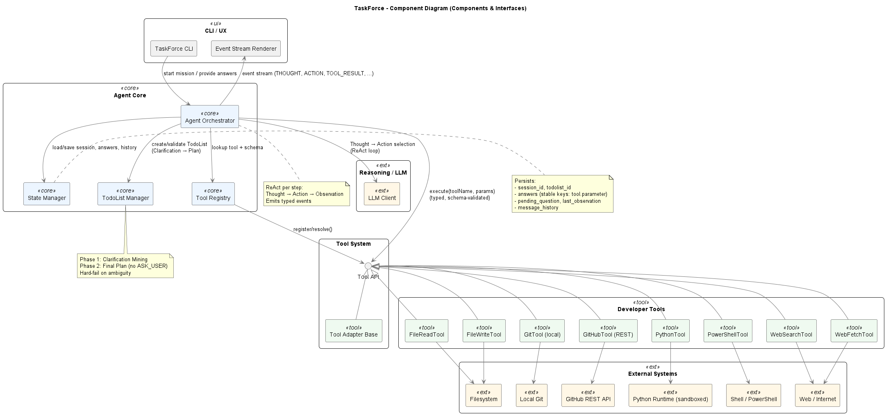
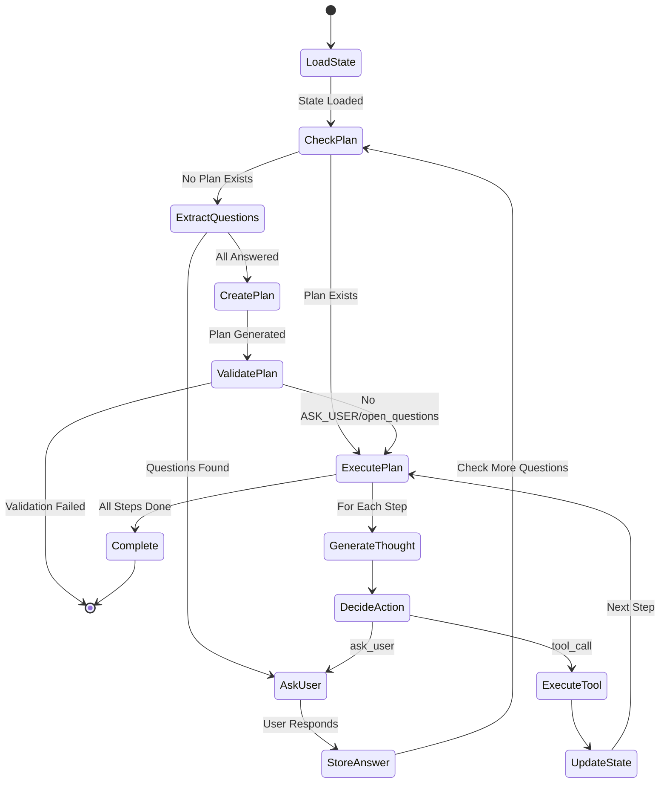
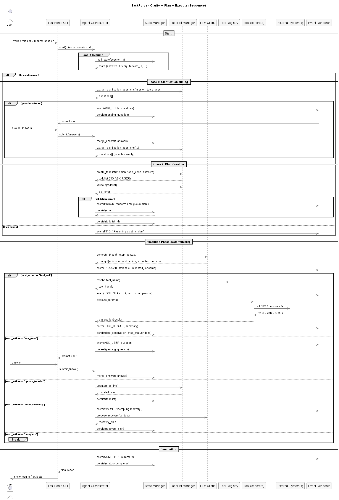

# Technical Report: TaskForce Agent Framework

## Executive Summary

TaskForce is my experimental agent framework, developed as part of my AI Solutions Architecture capstone project. With it, I set out to explore one of the hardest problems in agent design: how to make agents transparent, deterministic, and reliable.

Unlike many “demo agents” or chatbot wrappers, TaskForce focuses on disciplined clarification gathering, deterministic planning, and faithful execution with real developer tools. It’s not production-ready, but it demonstrates that with the right patterns, we can close some of the gap between toy examples and agents that developers can trust.

---

## 1. Introduction & Motivation

### 1.1 Project Context

This project was created as the final assignment for my AI Solutions Architecture course. I chose the “AI-Driven Code Assistant” track, but instead of building another chatbot interface, I decided to tackle the deeper architectural challenges: *What would it take to build an agent that can plan, clarify, and execute tasks in a way that is reliable and observable?*

### 1.2 Personal Motivation

I built TaskForce because I wanted to move beyond treating agents as black boxes. My goal was to understand how they:

* Ask the right clarifying questions upfront
* Generate deterministic, executable plans
* Faithfully execute those plans with real tools

Pretty quickly, I learned how difficult this is in practice. Timing of clarifications, state management, and tool parameterization all turned out to be surprisingly tricky. For me, TaskForce became both a framework and a personal learning journey into building transparent, developer-friendly agents.

### 1.3 Core Problem Statement

Most existing agent frameworks suffer from:

* **Unpredictable interruptions** (asking for clarification mid-execution)
* **Non-deterministic planning** (plans change mid-flight)
* **Poor observability** (hard to see how decisions are made)
* **Fragile tool integration** (parameter mismatches, weak schemas)

TaskForce addresses these by enforcing strict **phase separation** and deterministic execution patterns.

---

## 2. System Architecture

### 2.1 High-Level Design Philosophy

TaskForce uses a **two-phase execution model**:

1. **Pre-Clarification Phase** – collect *all* missing information upfront
2. **Execution Phase** – run a deterministic plan with no ambiguity

This design sacrifices some flexibility but ensures predictability and reliability.

---

### 2.2 Core Components

The following diagram shows all main components and how they are related to each other



#### Agent Orchestrator (`agent.py`)

The orchestrator is the central coordinator. It:

* Manages message history and context
* Orchestrates planning, state persistence, and tool execution
* Streams typed events (`THOUGHT`, `ACTION`, `TOOL_RESULT`, `ASK_USER`, `COMPLETE`)
* Runs the **ReAct loop**: Thought → Action → Observation

#### TodoList Manager (`planning/todolist.py`)

This enforces the strict two-phase planning approach.

**Phase 1 – Clarification Mining**

```python
async def extract_clarification_questions(self, mission: str, tools_desc: str) -> List[Dict[str, Any]]:
    # Returns: [{"key": "file_writer.filename", "question": "What should the file be named?"}]
```

**Phase 2 – Final Plan Generation**

```python
async def create_todolist(self, mission: str, tools_desc: str, answers: Dict) -> TodoList:
    # Creates deterministic plan with NO ASK_USER placeholders
    # Hard fails if ambiguity remains
```

TodoList items use **stable keys** (`tool.parameter`) so answers remain valid across sessions.

#### Tool System (`tool.py`, `tools/`)

All tools share the same base design:

```python
class Tool(ABC):
    @property
    @abstractmethod
    def name(self) -> str: ...
    
    @property
    def parameters_schema(self) -> Dict[str, Any]:
        return self._generate_schema_from_signature()
```

**Current toolset**:

* File operations (`FileReadTool`, `FileWriteTool`)
* Version control (`GitTool`, `GitHubTool`)
* Code execution (`PythonTool`)
* Shell access (`PowerShellTool`)
* Web tools (`WebSearchTool`, `WebFetchTool`)

#### State Manager (`statemanager.py`)

An async persistence layer to ensure continuity:

```python
state_schema = {
    "session_id": str,
    "todolist_id": str,
    "answers": Dict[str, Any],
    "pending_question": Dict,
    "last_observation": Dict,
    "message_history": List[Dict]
}
```

---

### 2.3 Execution Flow



This ensures that **no execution starts until all clarifications are resolved**.


This sequence diagram shows a typical TaskForce-Run: Clarify -> Plan -> Execute (ReAct Loop), EventStreaming and State-Persistence



---

## 3. Key Implementation Details

* **Clarification system**: auto-generates missing inputs based on tool schemas
* **Plan validation**: hard-fails if ambiguity remains
* **ReAct implementation**: each step has a structured thought → action → observation cycle
* **CLI integration**: interactive chat, session management, YAML config

---

## 4. Strengths & Innovations

* ✅ Deterministic planning (no ambiguity at runtime)
* ✅ Stable key tracking for cross-session consistency
* ✅ Auto-generated schemas from tool signatures
* ✅ Event-driven observability (typed events for debugging)
* ✅ Robust async state management

---

## 5. Current Limitations

* ❌ Rigid plans (no re-planning on failure)
* ❌ Basic error recovery only
* ❌ Single-agent only
* ❌ Limited toolset
* ❌ Not production-ready (no auth, scaling, monitoring)

---

## 6. Learning Outcomes

* LLMs still struggle with deterministic planning
* Parameter extraction is harder than expected
* State persistence is crucial for reliability
* Event streaming makes debugging much easier

---

## 7. Future Development Path

* **Short-term**: finish parameter hydration, add tests, extract Git policies
* **Mid-term**: re-planning on failure, parallel execution, richer tools
* **Long-term**: multi-agent setups, adaptive planning, production hardening

---

## 8. Conclusion

TaskForce is both a functional prototype and a personal learning artifact. It demonstrates that **clear architectural patterns**—phase separation, deterministic planning, stable state management—make agents more predictable and transparent.

While not production-ready, it closes part of the gap between “toy agents” and real-world systems. For me, TaskForce was proof that building reliable agents requires not just strong LLMs, but careful architecture and design discipline.