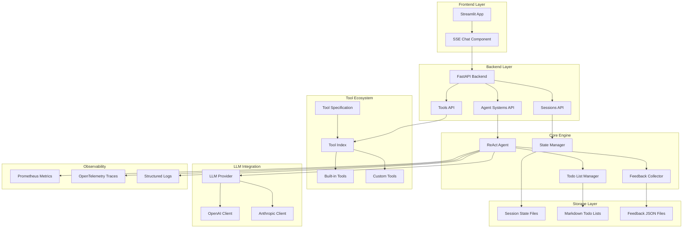

# Component Overview - IDP Copilot System

## System Map

## Component Responsibilities

### Frontend Components

#### Streamlit App (`capstone/frontend/streamlit_app.py`)
- **Purpose:** Web-based user interface for agent interaction
- **Key Functions:**
  - Session management and initialization
  - Agent system configuration
  - Real-time chat interface
  - Todo list visualization
- **Dependencies:** Streamlit, requests, PyYAML
- **Integration Points:** HTTP API calls to FastAPI backend

#### SSE Chat Component (`capstone/frontend/components/sse_chat.py`)
- **Purpose:** Real-time streaming communication with agent
- **Key Functions:**
  - Server-Sent Events (SSE) handling
  - Live agent response streaming
  - Chat history management
- **Integration:** WebSocket-style communication over HTTP

### Backend Components

#### FastAPI Backend (`capstone/backend/app/main.py`)
- **Purpose:** RESTful API service for agent orchestration
- **Key Routes:**
  - `/health` - Service health checks
  - `/agent-systems` - Agent configuration management
  - `/sessions` - Session lifecycle management
  - `/tools` - Tool inventory and execution
- **Middleware:** CORS support for frontend integration
- **Architecture:** Modular router-based design

#### Agent Systems API (`capstone/backend/app/api/agent_systems.py`)
- **Purpose:** Agent instance management and configuration
- **Responsibilities:**
  - Agent creation and initialization
  - System configuration validation
  - Agent lifecycle management

#### Sessions API (`capstone/backend/app/api/sessions.py`)
- **Purpose:** Session state and interaction management
- **Responsibilities:**
  - Session creation and termination
  - Message processing and routing
  - State persistence coordination

#### Tools API (`capstone/backend/app/api/tools.py`)
- **Purpose:** Tool discovery and execution interface
- **Responsibilities:**
  - Tool inventory management
  - Execution request routing
  - Result aggregation and formatting

### Core Engine Components

#### ReAct Agent (`capstone/prototype/agent.py`)
- **Purpose:** Main reasoning and action execution engine
- **Architecture:** Plan-first ReAct loop with loop guard
- **Key Features:**
  - Structured planning phase
  - Tool selection and execution
  - Continuous reasoning and adaptation
  - Error handling and recovery
- **State:** Session-based persistence with recovery capability

#### State Manager (`capstone/prototype/statemanager.py`)
- **Purpose:** Session state persistence and recovery
- **Storage Format:** Python pickle files
- **Location:** `./agent_states/<session_id>.pkl`
- **Capabilities:**
  - Session save/restore
  - State versioning
  - Concurrent access protection

#### Todo List Manager (`capstone/prototype/todolist_md.py`)
- **Purpose:** Structured task planning and tracking
- **Format:** Structured markdown with sections
- **Sections:**
  - Title and metadata
  - Task lists with status tracking
  - Open questions and notes
  - Progress tracking
- **Integration:** Real-time updates during agent execution

#### Feedback Collector (`capstone/prototype/feedback_collector.py`)
- **Purpose:** User feedback and execution metrics collection
- **Storage:** JSON files with timestamps
- **Data Types:**
  - User satisfaction ratings
  - Tool execution results
  - Performance metrics
  - Error reports

### Tool Ecosystem

#### Tool Specification (`capstone/prototype/tools.py`)
- **Purpose:** Tool definition and validation framework
- **Schema:** Standardized tool interface with JSON schemas
- **Features:**
  - Input/output validation
  - Async execution support
  - Timeout management
  - Alias support for tool discovery

#### Tool Index (`capstone/prototype/tools.py`)
- **Purpose:** Tool discovery and routing system
- **Capabilities:**
  - Name normalization and alias resolution
  - Tool lookup and execution
  - Capability introspection
  - Error handling and fallbacks

#### Built-in Tools (`capstone/prototype/tools_builtin.py`)
- **Repository Tools:**
  - `create_repository` - Git repo creation with GitHub integration
  - `validate_project_name_and_type` - Naming validation
  - `create_git_repository_with_branch_protection` - Advanced setup
- **CI/CD Tools:**
  - `setup_cicd_pipeline` - Pipeline configuration
  - `apply_template` / `list_templates` - Template management
- **Infrastructure Tools:**
  - `generate_k8s_manifests` - Kubernetes resource generation
  - `create_k8s_namespace` - Namespace management
  - `deploy_to_staging` - Deployment automation
- **Utility Tools:**
  - `search_knowledge_base_for_guidelines` - Documentation search
  - `setup_observability` - Monitoring configuration
  - `generate_documentation` - Auto-documentation

### LLM Integration Layer

#### LLM Provider (`capstone/prototype/llm_provider.py`)
- **Purpose:** Abstract interface for multiple LLM providers
- **Providers:**
  - OpenAI (GPT-3.5, GPT-4)
  - Anthropic (Claude models)
- **Features:**
  - Provider-agnostic API
  - Structured output with Pydantic
  - Retry logic and error handling
  - Token usage tracking

#### Provider Implementations
- **OpenAI Provider:** Direct API integration with function calling
- **Anthropic Provider:** Claude API with tool use support
- **Configuration:** Environment-based provider selection

### Storage Layer

#### Session State Files
- **Format:** Python pickle serialization
- **Location:** `./agent_states/`
- **Content:** Complete agent session context
- **Access Pattern:** Single-user, session-based isolation

#### Markdown Todo Lists
- **Format:** Structured markdown with YAML frontmatter
- **Location:** `./checklists/`
- **Structure:** Hierarchical task organization
- **Real-time Updates:** Live modification during execution

#### Feedback JSON Files
- **Format:** Timestamped JSON documents
- **Location:** `./feedback/`
- **Aggregation:** Batch processing for analytics
- **Schema:** Structured feedback with metadata

### Observability Layer

#### Prometheus Metrics
- **Metrics Server:** Embedded HTTP server on port 8070
- **Metric Types:**
  - Counters: Workflow starts, completions, failures
  - Histograms: Execution durations, tool performance
  - Gauges: Active workflow count
- **Labels:** Tool names, step types, success/failure status

#### OpenTelemetry Traces
- **Tracing:** Distributed trace collection
- **Exporters:** Console exporter (configurable)
- **Instrumentation:** Agent loops, tool execution, LLM calls
- **Correlation:** Trace context propagation

#### Structured Logs
- **Library:** structlog for consistent formatting
- **Levels:** Debug, info, warning, error with context
- **Format:** JSON-structured logs with metadata
- **Integration:** Correlated with traces and metrics

## Data Flow Patterns

### Agent Execution Flow
1. **Initialization:** Load session state and tool index
2. **Planning:** Generate structured todo list based on user input
3. **Execution Loop:**
   - Select next action from plan
   - Execute tool with validation
   - Update state and todo list
   - Collect feedback and metrics
4. **Completion:** Persist final state and results

### Tool Execution Flow
1. **Discovery:** Normalize tool name and resolve via index
2. **Validation:** Validate input against JSON schema
3. **Execution:** Async tool invocation with timeout
4. **Result Processing:** Validate output and update state
5. **Metrics:** Record execution time and success/failure

### State Persistence Flow
1. **Save Triggers:** After each significant state change
2. **Serialization:** Python pickle with error handling
3. **Atomic Writes:** Temporary file with atomic rename
4. **Recovery:** Automatic session restoration on restart

## Integration Patterns

### Frontend-Backend Integration
- **Protocol:** HTTP REST API with JSON payloads
- **Real-time:** Server-Sent Events for streaming responses
- **State Sync:** Session state coordination between layers
- **Error Handling:** Graceful degradation with user feedback

### Agent-Tool Integration
- **Discovery:** Name-based lookup with alias support
- **Execution:** Async invocation with timeout protection
- **Validation:** Schema-based input/output verification
- **Error Recovery:** Retry logic with exponential backoff

### LLM Provider Integration
- **Abstraction:** Common interface across providers
- **Function Calling:** Tool definitions exported as LLM functions
- **Structured Output:** Pydantic models for type safety
- **Rate Limiting:** Provider-specific throttling

## Security Boundaries

### Component Isolation
- **Process Boundaries:** Single-process model with internal isolation
- **Data Access:** File-based permissions and ownership
- **Network Isolation:** Local-only by default

### Secret Management
- **Environment Variables:** API keys and tokens
- **No Persistence:** Secrets not stored in state files
- **Access Control:** Process-level secret access

### Input Validation
- **Tool Inputs:** JSON schema validation
- **User Inputs:** Sanitization and validation
- **External APIs:** Response validation and error handling

## Performance Characteristics

### Execution Model
- **Synchronous Tools:** Sequential execution with blocking
- **Async Framework:** asyncio-based for I/O operations
- **Resource Usage:** Memory-efficient with pickle state
- **Scalability:** Single-user, single-machine model

### Optimization Points
- **Tool Caching:** Tool index precompilation
- **State Efficiency:** Selective state persistence
- **Network Optimization:** Connection pooling for external APIs
- **Memory Management:** Garbage collection and resource cleanup