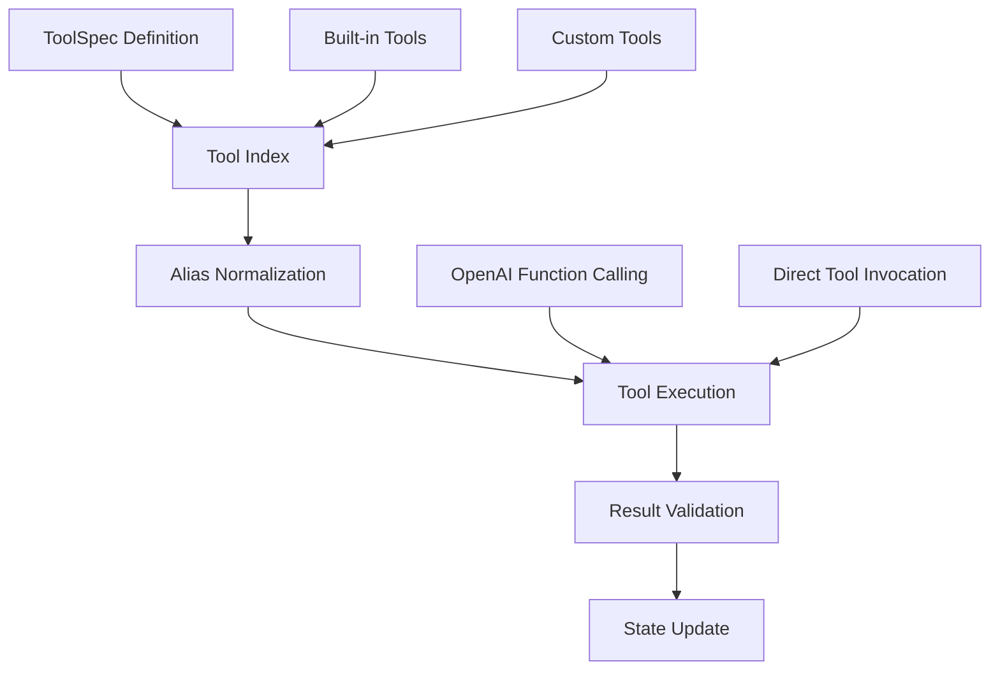
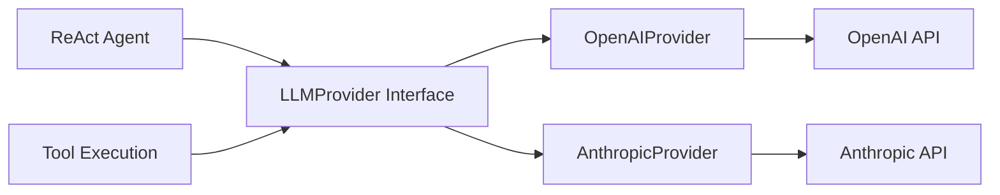

# IDP Copilot - Current System Architecture

## Overview

The IDP (Internal Developer Platform) Copilot is a sophisticated AI-driven automation system built around a ReAct (Reasoning + Acting) agent pattern. The system enables automated developer platform workflows through intelligent planning, tool execution, and state management.

## System Components

### 1. Core Prototype (`capstone/prototype/`)

**Purpose:** Standalone ReAct agent implementation with complete tool ecosystem

**Key Files:**
- `agent.py` - Main ReAct agent with plan-first heuristic and loop guard
- `tools.py` - Tool specification, normalization, execution, and indexing
- `tools_builtin.py` - Built-in tools for repository creation, CI/CD, K8s workflows
- `llm_provider.py` - LLM provider abstraction (OpenAI, Anthropic)
- `statemanager.py` - Session state persistence
- `todolist_md.py` - Markdown todo list creation and management
- `feedback_collector.py` - Feedback collection and storage
- `idp.py` - CLI entry point with Prometheus server

**Architecture Pattern:**
```
ReAct Agent Loop:
Plan → Tool Selection → Tool Execution → Observation → Re-plan
```

**State Management:**
- Session state: `./agent_states/<session_id>.pkl` (pickle format)
- Todo lists: `./checklists/*.md` (markdown format)
- Feedback: `./feedback/feedback_YYYYMMDD_HHMMSS.json`

### 2. Backend API (`capstone/backend/`)

**Purpose:** FastAPI-based microservice for agent orchestration

**Technology Stack:**
- FastAPI 0.111.0+
- Python 3.10+
- Uvicorn ASGI server
- CORS middleware enabled

**API Endpoints:**
- `/health` - Health check
- `/agent-systems` - Agent system management
- `/sessions` - Session management
- `/tools` - Tool management
- Stream endpoints for real-time communication

**Key Features:**
- RESTful API design
- Structured logging with structlog
- Prometheus metrics integration
- OpenTelemetry observability support

### 3. Frontend Interface (`capstone/frontend/`)

**Purpose:** Streamlit-based web interface for user interaction

**Technology Stack:**
- Streamlit 1.33+
- Server-Sent Events (SSE) for real-time updates
- HTTP client integration with backend
- YAML configuration support

**Key Features:**
- Real-time chat interface with agent
- Session state management
- Todo list visualization
- Agent system configuration

## Data Architecture

### Tool System Architecture



**Tool Specification Schema:**
```python
@dataclass
class ToolSpec:
    name: str
    description: str
    input_schema: Dict[str, Any]
    output_schema: Dict[str, Any]
    func: Callable[..., Union[JsonDict, Awaitable[JsonDict]]]
    is_async: bool = True
    timeout: Optional[float] = None
    aliases: Optional[List[str]] = None
    capabilities_provider: Optional[Callable[[], Dict[str, Any]]] = None
```

### State Persistence Model

**Session State (`StateManager`):**
- Format: Python pickle files
- Location: `./agent_states/`
- Content: Agent session data, conversation history, execution context

**Todo Lists (`TodoListMD`):**
- Format: Structured markdown
- Location: `./checklists/`
- Sections: Title, Meta, Tasks, Open Questions, Notes

**Feedback Collection:**
- Format: JSON files
- Location: `./feedback/`
- Content: User feedback, performance metrics, execution results

## LLM Integration Architecture

### Provider Abstraction



**Configuration:**
- Environment-based provider selection
- Structured output with Pydantic models
- Retry logic and error handling
- Token usage tracking

### Function Calling Integration

The system leverages LLM function calling for tool execution:

1. Tools exported as OpenAI function definitions
2. LLM selects appropriate tools based on context
3. Tool execution via normalized name/alias lookup
4. Results fed back to LLM for next reasoning step

## Built-in Tool Ecosystem

### Repository Management
- `create_repository` - Local Git repo creation with GitHub integration
- `validate_project_name_and_type` - Project naming validation
- `create_git_repository_with_branch_protection` - Advanced repo setup

### CI/CD Automation
- `setup_cicd_pipeline` - Pipeline configuration
- `apply_template` / `list_templates` - Template management

### Infrastructure & Deployment
- `generate_k8s_manifests` - Kubernetes manifest generation
- `create_k8s_namespace` - Namespace management
- `deploy_to_staging` - Deployment automation

### Documentation & Observability
- `search_knowledge_base_for_guidelines` - Knowledge base search
- `setup_observability` - Monitoring setup
- `generate_documentation` - Auto-documentation

## Observability & Monitoring

### Prometheus Metrics

**Core Metrics:**
- `idp_workflows_started` - Workflow initiation counter
- `idp_workflows_completed` - Successful completion counter
- `idp_workflows_failed` - Failure counter
- `idp_step_duration_seconds` - Step execution time histogram
- `idp_active_workflows` - Active workflow gauge
- `idp_tool_execution_seconds` - Tool execution time histogram
- `idp_tool_success` / `idp_tool_failure` - Tool success/failure counters

**Metrics Server:**
- Port: 8070
- Endpoint: `http://localhost:8070`
- Auto-started with CLI

### OpenTelemetry Integration

**Tracing Support:**
- Console exporter (configurable via `IDP_ENABLE_OTEL_CONSOLE`)
- Distributed tracing for tool execution
- Agent loop instrumentation

## Deployment Architecture

### Current Model
- **Local Development:** PowerShell-based setup with uv package management
- **Process Model:** Single-process agent with embedded metrics server
- **Storage:** File-based persistence in local directories
- **Dependencies:** Windows PowerShell, Git, Python 3.11+

### Environment Configuration

**Required:**
- `OPENAI_API_KEY` - OpenAI API access

**Optional:**
- `GITHUB_TOKEN` - GitHub integration
- `GITHUB_ORG` / `GITHUB_OWNER` - GitHub organization
- `IDP_ENABLE_OTEL_CONSOLE` - OpenTelemetry console output
- `AGENT_API_BASE_URL` - Backend API base URL (frontend)

## Security Architecture

### Authentication & Authorization
- API key-based LLM provider authentication
- GitHub token-based repository operations
- No built-in user authentication (single-user model)

### Data Protection
- Local file-based storage (no network persistence)
- Environment variable-based secrets management
- No sensitive data logging

## Technology Stack Summary

### Core Dependencies
- **Python:** 3.11+ (3.10+ for backend)
- **Package Management:** uv
- **Web Framework:** FastAPI
- **UI Framework:** Streamlit
- **LLM Providers:** OpenAI, Anthropic
- **Observability:** Prometheus, OpenTelemetry
- **Async Runtime:** asyncio

### Development Tools
- **Code Formatting:** Black (line-length: 100)
- **Linting:** Ruff
- **Testing:** pytest
- **Type Checking:** Built-in type annotations

## Integration Points

### Component Communication
1. **Prototype ↔ Backend:** Shared tool execution model
2. **Frontend ↔ Backend:** HTTP/SSE API communication
3. **Agent ↔ LLM:** Function calling and structured output
4. **Agent ↔ Tools:** Normalized name resolution and async execution

### External Integrations
1. **GitHub API:** Repository creation and management
2. **Kubernetes API:** Cluster operations and deployments
3. **LLM APIs:** OpenAI and Anthropic for agent reasoning
4. **Git CLI:** Local repository operations

## Architectural Strengths

1. **Modular Design:** Clear separation of concerns between components
2. **Extensible Tool System:** Easy addition of new capabilities via ToolSpec
3. **Provider Abstraction:** LLM-agnostic design with multiple provider support
4. **Observability-First:** Built-in metrics and tracing from the ground up
5. **State Persistence:** Reliable session recovery and audit trails
6. **Plan-First Approach:** Structured workflow planning before execution

## Current Limitations

1. **Single-User Model:** No multi-tenancy or user management
2. **File-Based Storage:** Limited scalability and concurrent access
3. **Local Deployment:** No distributed deployment support
4. **Windows-Centric:** Platform-specific PowerShell dependencies
5. **Synchronous Tools:** Limited parallel tool execution capabilities
6. **Manual Configuration:** Environment setup requires manual steps

## Next Architecture Evolution Opportunities

1. **Multi-User Support:** User authentication and session isolation
2. **Distributed Storage:** Database-backed persistence layer
3. **Container Deployment:** Docker/Kubernetes deployment models
4. **Async Tool Execution:** Parallel tool execution with dependency management
5. **Cross-Platform Support:** Linux/macOS compatibility
6. **Enterprise Integration:** SSO, RBAC, audit logging
7. **Real-Time Collaboration:** Multi-user agent collaboration
8. **Advanced Orchestration:** Complex workflow scheduling and management